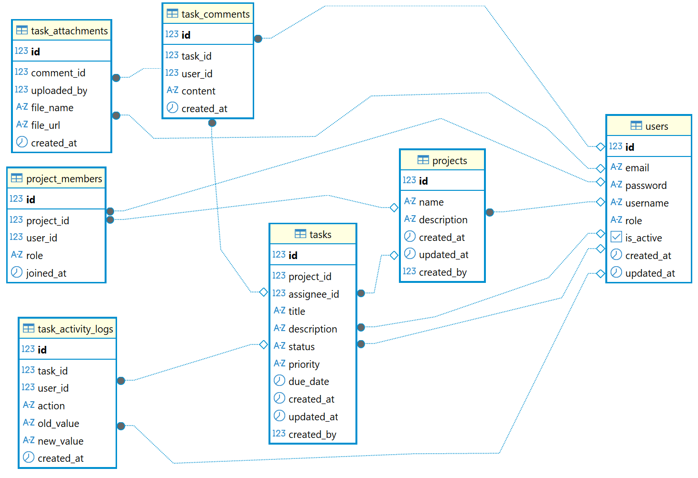

# 📋 Task Management System API

A modern REST API backend for collaborative task and project management with role-based access control built with Spring Boot.

    

---

## 🌟 Features

### Core Functionality
- **Project Management**: Full CRUD operations with hierarchical member roles (OWNER/MEMBER)
- **Task Tracking**: Complete workflow (TODO → IN_PROGRESS → DONE) with priority levels
- **Team Collaboration**: Comments, file attachments via Cloudinary, and activity logging
- **Advanced Filtering**: Sort, filter, and paginate tasks and projects
- **Authentication & Authorization**: JWT-based auth with role-based access control

### 🔐 Business Logic & Security

#### Project-Level Authorization
- **OWNER Role**: Full administrative control
    - Add/remove project members
    - Delete project and all associated tasks
    - Manage project settings
- **MEMBER Role**: Collaborative access
    - View project details
    - Create tasks within the project
    - Leave project voluntarily

#### Task-Level Authorization (Fine-Grained Access Control)
- **Create Task**: Any project MEMBER can create tasks
- **Update Task**: Allowed for:
    - Project OWNER (full access)
    - Task CREATOR (original creator)
    - Task ASSIGNEE (person assigned to the task)
- **Delete Task**: Restricted to:
    - Project OWNER
    - Task CREATOR only

#### Comment Authorization
- **Create Comment**: Any project member can comment on tasks
- **Update Comment**: Only the comment author can edit their own comments
- **Delete Comment**: Allowed for:
    - Comment author
    - Project OWNER (moderation capability)

#### User Roles (System-Level)
- **ADMIN**: Full system access, user management
- **USER**: Standard project and task access based on project membership

---

## 🛠️ Tech Stack

**Backend**: Java 17 • Spring Boot 3 • Spring Security (JWT) • JPA/Hibernate  
**Database**: PostgreSQL with normalized schema  
**Cloud Storage**: Cloudinary (media uploads)  
**Architecture**: Layered architecture (Controller → Service → Repository)  
**Documentation**: Swagger/OpenAPI  
**DevOps**: Docker, Maven

---

## 📊 Database Schema


---

## 📖 API Endpoints

### Authentication
- `POST /api/register` - Register new user
- `POST /api/login` - User login (returns JWT token)

### Projects
- `GET /api/projects` - Get all projects (with filtering/pagination)
- `POST /api/projects` - Create new project
- `GET /api/projects/{id}` - Get project details
- `PUT /api/projects/{id}` - Update project *(OWNER only)*
- `DELETE /api/projects/{id}` - Delete project *(OWNER only)*
- `GET /api/projects/my-projects` - Get current user's projects

### Project Members
- `GET /api/projects/{projectId}/members` - List all members
- `POST /api/projects/{projectId}/members` - Add member *(OWNER only)*
- `DELETE /api/projects/{projectId}/members/{username}` - Remove member *(OWNER only)*
- `POST /api/projects/{projectId}/members/leave` - Leave project

### Tasks
- `GET /api/projects/{projectId}/tasks` - List tasks (filters: status, priority, assignee)
- `POST /api/projects/{projectId}/tasks` - Create task *(any MEMBER)*
- `GET /api/projects/{projectId}/tasks/{taskId}` - Get task details
- `PUT /api/projects/{projectId}/tasks/{taskId}` - Update task *(OWNER/CREATOR/ASSIGNEE)*
- `DELETE /api/projects/{projectId}/tasks/{taskId}` - Delete task *(OWNER/CREATOR)*

### Task Comments
- `GET /api/projects/{projectId}/tasks/{taskId}/comments` - List comments
- `POST /api/projects/{projectId}/tasks/{taskId}/comments` - Add comment *(any MEMBER)*
- `PUT /api/projects/{projectId}/tasks/{taskId}/comments/{commentId}` - Update comment *(author only)*
- `DELETE /api/projects/{projectId}/tasks/{taskId}/comments/{commentId}` - Delete comment *(author/OWNER)*

### Attachments
- `POST /api/projects/{projectId}/tasks/{taskId}/comments/{commentId}/attachments` - Upload file (Cloudinary)
- `GET /api/projects/{projectId}/tasks/{taskId}/comments/{commentId}/attachments` - List attachments
- `DELETE /api/attachments/{id}` - Delete attachment

### Users *(Admin Only)*
- `GET /api/users` - List all users
- `POST /api/users` - Create user
- `PUT /api/users/{id}` - Update user
- `DELETE /api/users/{id}` - Delete user
- `PUT /api/users/{id}/role` - Update user role (ADMIN/USER)

---

## 🚀 Quick Start

### Prerequisites
- Java 17+
- Maven 3.6+
- PostgreSQL 12+
- Docker (optional)

### Setup

1. **Clone the repository**
```bash
git clone https://github.com/SmaugTHEDrag/task_management_backend.git
cd task_management_backend
```

2. **Configure environment variables**

Create a `.env` file or set environment variables:
```env
DB_HOST=localhost
DB_PORT=5432
DB_NAME=task_management_db
DB_USERNAME=your_username
DB_PASSWORD=your_password

CLOUDINARY_NAME=your_cloud_name
CLOUDINARY_API_KEY=your_api_key
CLOUDINARY_API_SECRET=your_api_secret

JWT_SECRET=your_jwt_secret_key_min_256_bits
JWT_EXPIRE=your_jwt_expiration_time
```

Or update `application.yml`:
```yml
spring:
  application:
    name: Task Management System
  
  datasource:
    url: jdbc:postgresql://localhost:5432/task_management_db
    username: your_username
    password: your_password
    driver-class-name: org.postgresql.Driver
  
  jpa:
    hibernate:
      ddl-auto: update
    show-sql: true
    properties:
      hibernate:
        format_sql: true
jwt:
  secret: your_jwt_secret_key_min_256_bits
  expiration: your_jwt_expiration_time
  
cloudinary:
  cloud_name: your_cloud_name
  api_key: your_api_key
  api_secret: your_api_secret

springdoc:
  swagger-ui:
    tags-sorter: alpha
```

3. **Build and run**
```bash
# Standard run
mvn clean install
mvn spring-boot:run

# Docker run (recommended)
docker-compose up -d
```

4. **Access the application**
- API Base URL: `http://localhost:8080`
- Swagger Documentation: `http://localhost:8080/swagger-ui/index.html`


---

## 🏗️ Architecture

### Layered Architecture
```
Controllers (REST Endpoints)
    ↓
Security Layer (JWT + Custom Authorization)
    ↓
Service Layer (Business Logic)
    ↓
Repository Layer (JPA/Hibernate)
    ↓
Database (PostgreSQL)
```

### Security Components
- **JwtAuthenticationFilter**: Validates JWT tokens on each request
- **TaskSecurity**: Custom task-level authorization logic
- **TaskCommentSecurity**: Comment-level access control
- **ProjectSecurity**: Project ownership verification

### Key Design Patterns
- **Repository Pattern**: Data access abstraction
- **Service Layer Pattern**: Business logic encapsulation
- **DTO Pattern**: Request/Response data transfer
- **Custom Security Beans**: Fine-grained method-level authorization

---

## 📝 Key Business Rules

1. **Project Membership Required**: Users must be project members to access any project resources
2. **Task Creator Tracking**: System tracks who created each task for authorization
3. **Assignee-Based Access**: Task assignees have update rights to their assigned tasks
4. **Owner Supremacy**: Project owners have full control over project resources
5. **Comment Ownership**: Users can only edit their own comments (except project owners)
6. **Cascading Deletion**: Deleting a project removes all associated tasks, comments, and attachments
7. **Role Hierarchy**: ADMIN > OWNER > MEMBER > Non-member

---

## 📚 API Documentation

Full interactive API documentation is available via Swagger UI after running the application:

👉 **[https://task-management-backend-lfa5.onrender.com/swagger-ui/index.html)**

---

## 👨‍💻 About the Developer
<div align="center">

<h1>Pham Thai Nguyen</h1>

[](https://github.com/SmaugTHEDrag)
[](mailto:thainguyen122004@gmail.com)
[](https://linkedin.com/in/yourprofile)

*Java Backend developer passionate about creating modern, scalable applications*

</div>


<div align="center">

**⭐ If you found this project helpful, please give it a star! ⭐**

Made with ❤️ and ☕ by [Pham Thai Nguyen](https://github.com/SmaugTHEDrag)

---

</div>